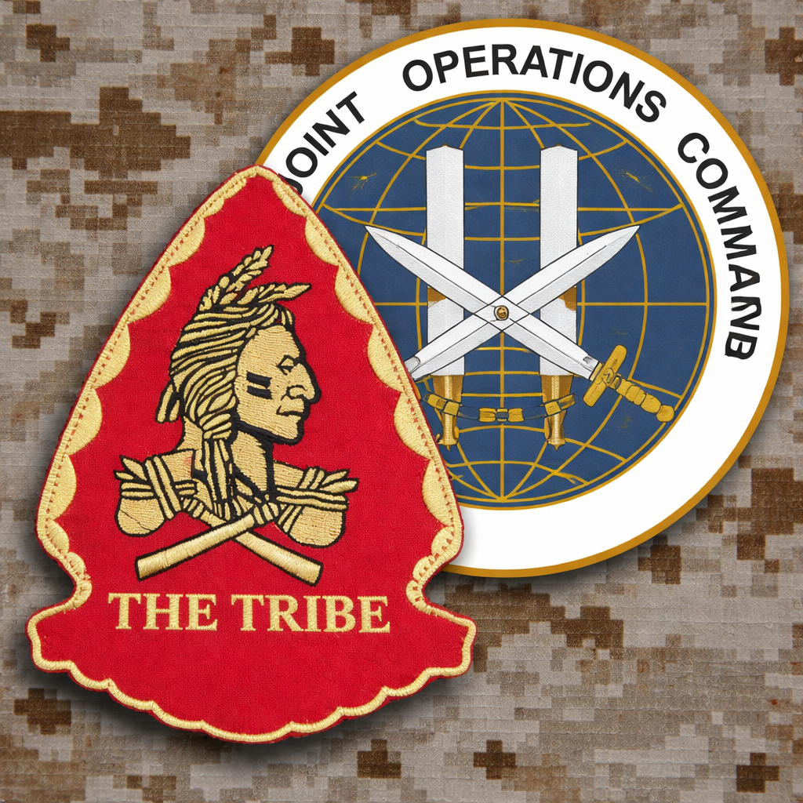

<div align="center">
  
  
  # Red Squadron
  **Joint Special Operations Command — Milsim Landing Page**
  
  A sleek, modern, and highly-dynamic web application designed for the Red Squadron military simulation community. Built with premium tech-startup aesthetics, glassmorphism UI, and centralized data management.
</div>

---

## ⚡ Features

- **Modern Glassmorphism UI**: High-end visual design with deep dark modes, custom color palettes (Tribe Red & Tribe Gold), and interactive gradient orbs.
- **Scroll-Snapping Navigation**: Premium single-page application feel with CSS-driven scroll snapping.
- **Dynamic Content Management**: A single source of truth (`data.js`) powers the entire site. Update the roster, operations, and site text without ever touching the HTML.
- **Automated Calculations**: JavaScript automatically calculates and updates the "Time in Service" for all members based on their enlistment date.
- **Interactive Roster**: A fully-fleshed 15-slot operator roster with scroll-linked sidebar navigation.
- **Operations Log**: A Discord-forum style feed of classified after-action reports and mission logs.
- **Responsive Design**: Built using modern `clamp()` typography and CSS Grid/Flexbox to look flawless on any device size.

---

## 🛠️ Tech Stack

- **HTML5** — Semantic, accessible structure
- **CSS3** — Vanilla CSS, Keyframe Animations, CSS Variables, Glassmorphism
- **Vanilla JavaScript** — DOM manipulation, Intersection Observers, Dynamic Rendering
- **Python** (Dev Tools) — Included scripts for local server hosting and favicon generation

---

## 📂 Project Structure

```text
RED-ASQN-04-16-26/
├── index.html          # Landing page (Hero & About sections)
├── roster.html         # Interactive member roster
├── operations.html     # Mission logs and after-action reports
├── data.js             # ⚠️ CORE CONFIG: Edit this to update site text, roster, and ops!
├── style.css           # Global styles, variables, and animations
├── roster.css          # Roster-specific layouts
├── operations.css      # Operations-specific layouts
├── logo.png            # Main brand asset
├── favicon.png         # Auto-generated circular favicon
├── make_roster.py      # Python script used to initially generate the 15 roster slots
└── main.py             # Simple Python HTTP server for local testing
```

---

## ⚙️ How to Update Content (The Easy Way)

You do **not** need to edit the HTML files to update the website's text, members, or operations. Everything is controlled via `data.js`.

1. Open `data.js` in your code editor.
2. **Global Settings**: Update the `DISCORD_LINK` or `SITE_INFO.about` text at the top.
3. **Update Roster**: Scroll to the `ROSTER` array. Edit callsigns, ranks, MOS, or start dates. The site will automatically calculate their "Time in Service".
4. **Post an Operation**: Scroll to the `OPERATIONS` array. Copy an existing block, paste it at the top, and fill in the details. It will automatically render as a new card on the Operations page.

---

## 🚀 Running Locally

To view the site exactly as it will appear in production, run a local web server (to ensure JavaScript modules and CORS policies work correctly).

If you have Python installed, you can simply run:
```bash
python main.py
```
Then open your browser and navigate to `http://localhost:8000`.

---

<div align="center">
  <i>"Execute where others cannot."</i><br>
  Built for <b>Red Squadron</b>
</div>
